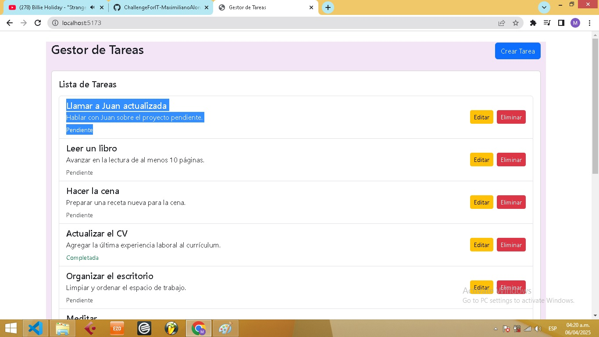

# Challenge ingreso a Academia ForIT 2025

## Descripción

Este proyecto cuenta con un backend hecho con **Node.js** y **Express**, que expone una **API REST** con persistencia de datos utilizando **SQLite3**.  
Para el frontend se utilizó **React** con **Vite**, además de **Bootstrap** para los estilos y **SweetAlert** para las alertas interactivas.

## Instrucciones

(En la raíz se encuentra el archivo `package.json` con todo lo necesario para levantar tanto el backend como el frontend)

### Pasos para ejecutar el proyecto

- Ejecutar `npm install` en la raiz del proyecto 
  _(Instalará todas las dependencias del proyecto)_

- Una vez instaladas, ejecutar `npm run dev`  
  _(Inicializará el backend y el frontend)_

## Capturas de pantalla

### Vista general

### Crear tarea

### Tarea creada

### Modiicar tarea

### Tarea Modiicada

### Eliminar tarea

### Tarea Eliminada

